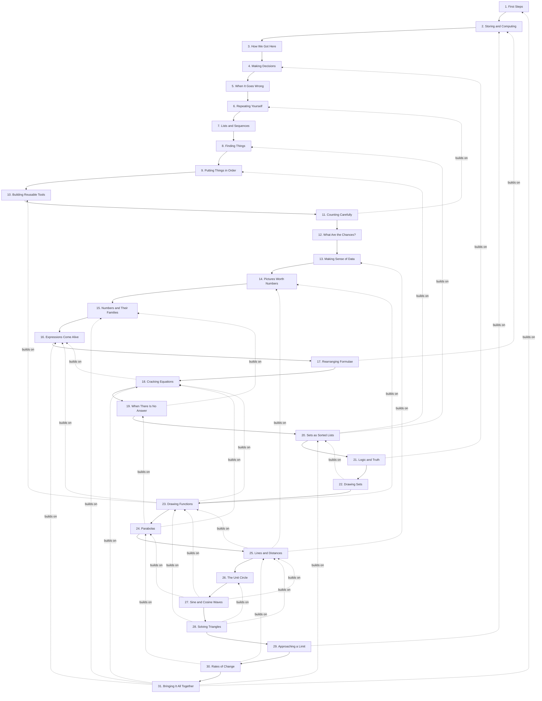

# Curriculum map

**Generated — do not edit by hand.** `python3 dev/curriculum_map.py`
rebuilds it from three files, and CI fails if this one is out of date:

- `planning/curriculum/outcomes.yaml` — every learning outcome in the two
  QQI module descriptors.
- each tutorial's `covers:` frontmatter — which outcome each section
  teaches, and which it only uses.
- `planning/curriculum/out-of-scope.yaml` — what we have decided not to
  teach, so a decision stops looking like a gap.

Every link below goes to the section of the live site that does the work,
so this doubles as a way of finding where anything is taught.

## Where we stand

**68 of 80** outcomes are in place.

- 🟩 **66 taught** — a tutorial section teaches it.
- 🟦 **2 taught in part** — deliberately narrowed, and the narrowed version is written.
- 🟨 **2 used but not taught** — students meet it in passing without it ever being the subject. These are the quiet gaps: they look covered from a distance.
- 🟥 **10 not covered** — nothing in dewlab touches it.

**12 of the 12 outcomes still to write have no proposal**: `CMPS-LO1`, `CMPS-LO10`, `CMPS-LO11`, `CMPS-LO12`, `CMPS-LO13`, `CMPS-LO2`, `CMPS-LO3`, `CMPS-LO5`, `CMPS-LO6`, `CMPS-LO7`, `CMPS-LO8`, `CMPS-LO9`. These are the ones nobody has decided how to teach yet.

### By strand

| Strand | 🟩 Taught | 🟦 Part, by choice | 🟨 Used only | 🟥 Not covered | ⬜ Out of scope |
|---|---:|---:|---:|---:|---:|
| **algebra** | 7 | 1 | 0 | 0 | 0 |
| **algorithms** | 9 | 0 | 0 | 0 | 0 |
| **calculus** | 2 | 1 | 0 | 0 | 0 |
| **complexity** | 0 | 0 | 0 | 2 | 0 |
| **data-structures** | 0 | 0 | 1 | 0 | 0 |
| **functions** | 3 | 0 | 0 | 0 | 0 |
| **geometry** | 6 | 0 | 0 | 0 | 0 |
| **linear-algebra** | 1 | 0 | 0 | 0 | 0 |
| **logic** | 2 | 0 | 0 | 0 | 0 |
| **modelling** | 0 | 0 | 0 | 2 | 0 |
| **number** | 2 | 0 | 0 | 0 | 0 |
| **probability** | 8 | 0 | 1 | 1 | 0 |
| **problem-solving** | 0 | 0 | 0 | 3 | 0 |
| **programming** | 11 | 0 | 0 | 0 | 0 |
| **reflection** | 0 | 0 | 0 | 1 | 0 |
| **sets** | 3 | 0 | 0 | 0 | 0 |
| **simulation** | 0 | 0 | 0 | 1 | 0 |
| **statistics** | 5 | 0 | 0 | 0 | 0 |
| **trigonometry** | 7 | 0 | 0 | 0 | 0 |

```mermaid
graph LR
  algebra["algebra<br/>8 of 8 in place"]
  algorithms["algorithms<br/>9 of 9 in place"]
  calculus["calculus<br/>3 of 3 in place"]
  complexity["complexity<br/>0 of 2 in place"]
  data_structures["data-structures<br/>0 of 1 in place"]
  functions["functions<br/>3 of 3 in place"]
  geometry["geometry<br/>6 of 6 in place"]
  linear_algebra["linear-algebra<br/>1 of 1 in place"]
  logic["logic<br/>2 of 2 in place"]
  modelling["modelling<br/>0 of 2 in place"]
  number["number<br/>2 of 2 in place"]
  probability["probability<br/>8 of 10 in place"]
  problem_solving["problem-solving<br/>0 of 3 in place"]
  programming["programming<br/>11 of 11 in place"]
  reflection["reflection<br/>0 of 1 in place"]
  sets["sets<br/>3 of 3 in place"]
  simulation["simulation<br/>0 of 1 in place"]
  statistics["statistics<br/>5 of 5 in place"]
  trigonometry["trigonometry<br/>7 of 7 in place"]

  classDef full fill:#edf7f0,stroke:#1f6b3f,color:#1f6b3f;
  classDef part fill:#fdf6ec,stroke:#b5651d,color:#7a4310;
  classDef none fill:#fdf0ef,stroke:#9b2226,color:#9b2226;
  class algebra,algorithms,calculus,functions,geometry,linear_algebra,logic,number,programming,sets,statistics,trigonometry full;
  class probability part;
  class complexity,data_structures,modelling,problem_solving,reflection,simulation none;
```



## The series as it stands

Solid arrows are the reading order. A dashed arrow means the later
tutorial names the earlier one in its own text — evidence of a real
dependency rather than an intention, found by reading the tutorials
themselves. A tutorial with several dashed arrows into it is
load-bearing and expensive to move; one with none is cheap to move, and
possibly not pulling its weight where it is.



## What is missing, and where it would go

Dashed boxes are proposed. Placement is argued in
`planning/curriculum/proposed.yaml` and each has an outline in
`planning/outlines/`.

```mermaid
graph TD
  T1["1. First Steps"]
  T2["2. Storing and Computing"]
  T3["3. How We Got Here"]
  T4["4. Making Decisions"]
  T5["5. When It Goes Wrong"]
  T6["6. Repeating Yourself"]
  T7["7. Lists and Sequences"]
  T8["8. Finding Things"]
  T9["9. Putting Things in Order"]
  T10["10. Building Reusable Tools"]
  T11["11. Counting Carefully"]
  T12["12. What Are the Chances?"]
  T13["13. Making Sense of Data"]
  T14["14. Pictures Worth Numbers"]
  T15["15. Numbers and Their Families"]
  T16["16. Expressions Come Alive"]
  T17["17. Rearranging Formulae"]
  T18["18. Cracking Equations"]
  T19["19. When There Is No Answer"]
  T20["20. Sets as Sorted Lists"]
  T21["21. Logic and Truth"]
  T22["22. Drawing Sets"]
  T23["23. Drawing Functions"]
  T24["24. Parabolas"]
  T25["25. Lines and Distances"]
  T26["26. The Unit Circle"]
  T27["27. Sine and Cosine Waves"]
  T28["28. Solving Triangles"]
  T29["29. Approaching a Limit"]
  T30["30. Rates of Change"]
  T31["31. Bringing It All Together"]

  T1 --> T2
  T2 --> T3
  T3 --> T4
  T4 --> T5
  T5 --> T6
  T6 --> T7
  T7 --> T8
  T8 --> T9
  T9 --> T10
  T10 --> T11
  T11 --> T12
  T12 --> T13
  T13 --> T14
  T14 --> T15
  T15 --> T16
  T16 --> T17
  T17 --> T18
  T18 --> T19
  T19 --> T20
  T20 --> T21
  T21 --> T22
  T22 --> T23
  T23 --> T24
  T24 --> T25
  T25 --> T26
  T26 --> T27
  T27 --> T28
  T28 --> T29
  T29 --> T30
  T30 --> T31


  classDef new fill:#fdf6ec,stroke:#b5651d,color:#7a4310,stroke-dasharray:4 3;
  class  new;
```

| Proposed | Goes after | Closes | Size |
|---|---|---|---|

## Every outcome

### Maths for Information Technology 5N18396

#### 1. Basic Arithmetic and Algebra

| Outcome | | Where |
|---|---|---|
| `MIT-1.1` Operations in N, Z, Q, R; powers (the syllabus says indices) and logarithms | 🟩 | [Making Decisions — Classifying Numbers: A Mathematical Application](https://deweydex.github.io/dewlab/tutorials/mit-pdp-maths-prog-integration/making-decisions.html#classifying-numbers-a-mathematical-application)<br/>[Numbers and Their Families — Powers and Their Rules](https://deweydex.github.io/dewlab/tutorials/mit-pdp-maths-prog-integration/numbers-and-their-families.html#powers-and-their-rules)<br/>[Numbers and Their Families — Logarithms: The Inverse of Powers](https://deweydex.github.io/dewlab/tutorials/mit-pdp-maths-prog-integration/numbers-and-their-families.html#logarithms-the-inverse-of-powers) |
| `MIT-1.2` Area and perimeter: square, rectangle, triangle, circle | 🟩 | [Numbers and Their Families — Practical Geometry: Formulas as Functions](https://deweydex.github.io/dewlab/tutorials/mit-pdp-maths-prog-integration/numbers-and-their-families.html#practical-geometry-formulas-as-functions) |
| `MIT-1.3` Volume and surface area: cube, cylinder, cone, sphere | 🟩 | [Numbers and Their Families — Practical Geometry: Formulas as Functions](https://deweydex.github.io/dewlab/tutorials/mit-pdp-maths-prog-integration/numbers-and-their-families.html#practical-geometry-formulas-as-functions) |
| `MIT-1.4` Binary and hexadecimal arithmetic and conversion | 🟩 | [Storing and Computing — Number Systems: How Computers Count](https://deweydex.github.io/dewlab/tutorials/mit-pdp-maths-prog-integration/storing-and-computing.html#number-systems-how-computers-count)<br/>_used in:_ [How We Got Here — The Only Language the Machine Understands](https://deweydex.github.io/dewlab/tutorials/mit-pdp-maths-prog-integration/how-we-got-here.html#the-only-language-the-machine-understands)<br/>_used in:_ [How We Got Here — Assembly, and Why Hexadecimal Exists](https://deweydex.github.io/dewlab/tutorials/mit-pdp-maths-prog-integration/how-we-got-here.html#assembly-and-why-hexadecimal-exists) |
| `MIT-1.5` Distinguish an expression from an equation | 🟦 | [Expressions Come Alive — Expressions versus Equations](https://deweydex.github.io/dewlab/tutorials/mit-pdp-maths-prog-integration/expressions-come-alive.html#expressions-versus-equations)<br/>**Narrowed:** not the formal expression-versus-equation distinction as an assessed item |
| `MIT-1.6` Evaluate, expand and simplify expressions | 🟩 | [Expressions Come Alive — Representing Polynomials](https://deweydex.github.io/dewlab/tutorials/mit-pdp-maths-prog-integration/expressions-come-alive.html#representing-polynomials)<br/>[Expressions Come Alive — Evaluating Polynomials](https://deweydex.github.io/dewlab/tutorials/mit-pdp-maths-prog-integration/expressions-come-alive.html#evaluating-polynomials)<br/>[Expressions Come Alive — Displaying Polynomials](https://deweydex.github.io/dewlab/tutorials/mit-pdp-maths-prog-integration/expressions-come-alive.html#displaying-polynomials)<br/>[Expressions Come Alive — Adding Polynomials](https://deweydex.github.io/dewlab/tutorials/mit-pdp-maths-prog-integration/expressions-come-alive.html#adding-polynomials)<br/>[Expressions Come Alive — Subtracting and Scaling](https://deweydex.github.io/dewlab/tutorials/mit-pdp-maths-prog-integration/expressions-come-alive.html#subtracting-and-scaling)<br/>_used in:_ [Bringing It All Together — Problem 1: The Polynomial Workshop](https://deweydex.github.io/dewlab/tutorials/mit-pdp-maths-prog-integration/bringing-it-all-together.html#problem-1-the-polynomial-workshop) |
| `MIT-1.7` Transpose formulae; operate on rational algebraic expressions | 🟩 | [Rearranging Formulae — The Same Formula, Five Ways](https://deweydex.github.io/dewlab/tutorials/mit-pdp-maths-prog-integration/rearranging-formulae.html#the-same-formula-five-ways)<br/>[Rearranging Formulae — The Moves](https://deweydex.github.io/dewlab/tutorials/mit-pdp-maths-prog-integration/rearranging-formulae.html#the-moves)<br/>[Rearranging Formulae — When the Unknown Is Underneath](https://deweydex.github.io/dewlab/tutorials/mit-pdp-maths-prog-integration/rearranging-formulae.html#when-the-unknown-is-underneath)<br/>[Rearranging Formulae — Checking Yourself](https://deweydex.github.io/dewlab/tutorials/mit-pdp-maths-prog-integration/rearranging-formulae.html#checking-yourself)<br/>_used in:_ [Cracking Equations — Solving Linear Equations](https://deweydex.github.io/dewlab/tutorials/mit-pdp-maths-prog-integration/cracking-equations.html#solving-linear-equations) |
| `MIT-1.8` Multiply linear expressions into quadratics and cubics | 🟩 | [Expressions Come Alive — Multiplying Polynomials](https://deweydex.github.io/dewlab/tutorials/mit-pdp-maths-prog-integration/expressions-come-alive.html#multiplying-polynomials)<br/>_used in:_ [Bringing It All Together — Problem 1: The Polynomial Workshop](https://deweydex.github.io/dewlab/tutorials/mit-pdp-maths-prog-integration/bringing-it-all-together.html#problem-1-the-polynomial-workshop) |
| `MIT-1.9` Factor quadratics by inspection and solve them | 🟩 | [Cracking Equations — Factorisation](https://deweydex.github.io/dewlab/tutorials/mit-pdp-maths-prog-integration/cracking-equations.html#factorisation) |
| `MIT-1.10` Solve quadratics, including complex roots | 🟩 | [When There Is No Answer — The Cliff Edge](https://deweydex.github.io/dewlab/tutorials/mit-pdp-maths-prog-integration/complex-roots.html#the-cliff-edge)<br/>[When There Is No Answer — Inventing a Number](https://deweydex.github.io/dewlab/tutorials/mit-pdp-maths-prog-integration/complex-roots.html#inventing-a-number)<br/>[When There Is No Answer — Roots That Are Not Real](https://deweydex.github.io/dewlab/tutorials/mit-pdp-maths-prog-integration/complex-roots.html#roots-that-are-not-real)<br/>[When There Is No Answer — They Come in Pairs](https://deweydex.github.io/dewlab/tutorials/mit-pdp-maths-prog-integration/complex-roots.html#they-come-in-pairs)<br/>_used in:_ [Cracking Equations — The Quadratic Formula](https://deweydex.github.io/dewlab/tutorials/mit-pdp-maths-prog-integration/cracking-equations.html#the-quadratic-formula) |
| `MIT-1.11` Solve linear inequalities | 🟩 | [Cracking Equations — Solving Inequalities](https://deweydex.github.io/dewlab/tutorials/mit-pdp-maths-prog-integration/cracking-equations.html#solving-inequalities) |
| `MIT-1.12` Simultaneous equations in two and three unknowns | 🟩 | [Cracking Equations — Simultaneous Equations](https://deweydex.github.io/dewlab/tutorials/mit-pdp-maths-prog-integration/cracking-equations.html#simultaneous-equations)<br/>_used in:_ [Solving Systems — Three Unknowns, Row by Row](https://deweydex.github.io/dewlab/tutorials/computational-methods/solving-systems.html#three-unknowns-row-by-row)<br/>_used in:_ [Bringing It All Together — Problem 2: Where Do They Meet?](https://deweydex.github.io/dewlab/tutorials/mit-pdp-maths-prog-integration/bringing-it-all-together.html#problem-2-where-do-they-meet) |

#### 2. Set Theory and Boolean Logic

| Outcome | | Where |
|---|---|---|
| `MIT-2.1` Set language: N, Z, Q, R, C, the empty set; finite, infinite, cardinality | 🟩 | [Numbers and Their Families — The Number Domains](https://deweydex.github.io/dewlab/tutorials/mit-pdp-maths-prog-integration/numbers-and-their-families.html#the-number-domains)<br/>[Sets as Sorted Lists — Making a Set](https://deweydex.github.io/dewlab/tutorials/mit-pdp-maths-prog-integration/sets-as-sorted-lists.html#making-a-set)<br/>[Sets as Sorted Lists — Membership Testing](https://deweydex.github.io/dewlab/tutorials/mit-pdp-maths-prog-integration/sets-as-sorted-lists.html#membership-testing)<br/>[Sets as Sorted Lists — Set Language and Notation](https://deweydex.github.io/dewlab/tutorials/mit-pdp-maths-prog-integration/sets-as-sorted-lists.html#set-language-and-notation)<br/>_used in:_ [When There Is No Answer — Inventing a Number](https://deweydex.github.io/dewlab/tutorials/mit-pdp-maths-prog-integration/complex-roots.html#inventing-a-number) |
| `MIT-2.2` Set operations: union, intersection, complement, symmetric difference, Cartesian product, power set | 🟩 | [Sets as Sorted Lists — Set Operations: The Merge Pattern](https://deweydex.github.io/dewlab/tutorials/mit-pdp-maths-prog-integration/sets-as-sorted-lists.html#set-operations-the-merge-pattern)<br/>[Sets as Sorted Lists — Sets in Practice](https://deweydex.github.io/dewlab/tutorials/mit-pdp-maths-prog-integration/sets-as-sorted-lists.html#sets-in-practice)<br/>_used in:_ [Bringing It All Together — Problem 3: Sets of Solutions](https://deweydex.github.io/dewlab/tutorials/mit-pdp-maths-prog-integration/bringing-it-all-together.html#problem-3-sets-of-solutions) |
| `MIT-2.3` Venn diagrams for two and three sets | 🟩 | [Drawing Sets — Two Circles, from Real Sets](https://deweydex.github.io/dewlab/tutorials/mit-pdp-maths-prog-integration/venn-diagrams.html#two-circles-from-real-sets)<br/>[Drawing Sets — The Regions Have Names You Already Know](https://deweydex.github.io/dewlab/tutorials/mit-pdp-maths-prog-integration/venn-diagrams.html#the-regions-have-names-you-already-know)<br/>[Drawing Sets — Three Sets, Which Is Where It Earns Its Place](https://deweydex.github.io/dewlab/tutorials/mit-pdp-maths-prog-integration/venn-diagrams.html#three-sets-which-is-where-it-earns-its-place)<br/>[Drawing Sets — The Same Laws, in a Different Notation](https://deweydex.github.io/dewlab/tutorials/mit-pdp-maths-prog-integration/venn-diagrams.html#the-same-laws-in-a-different-notation) |
| `MIT-2.4` Truth tables: AND, NOT, OR, XOR | 🟩 | [Logic and Truth — Every Possible Case](https://deweydex.github.io/dewlab/tutorials/mit-pdp-maths-prog-integration/logic-and-truth.html#every-possible-case)<br/>[Logic and Truth — Exclusive Or](https://deweydex.github.io/dewlab/tutorials/mit-pdp-maths-prog-integration/logic-and-truth.html#exclusive-or)<br/>_used in:_ [Making Decisions — Boolean Operators: Combining Conditions](https://deweydex.github.io/dewlab/tutorials/mit-pdp-maths-prog-integration/making-decisions.html#boolean-operators-combining-conditions) |
| `MIT-2.5` De Morgan's Laws | 🟩 | [Logic and Truth — De Morgan's Laws](https://deweydex.github.io/dewlab/tutorials/mit-pdp-maths-prog-integration/logic-and-truth.html#de-morgans-laws)<br/>[Logic and Truth — Where You Have Already Used This](https://deweydex.github.io/dewlab/tutorials/mit-pdp-maths-prog-integration/logic-and-truth.html#where-you-have-already-used-this)<br/>[Logic and Truth — The Same Shapes, on Sets](https://deweydex.github.io/dewlab/tutorials/mit-pdp-maths-prog-integration/logic-and-truth.html#the-same-shapes-on-sets) |

#### 3. Functions and Calculus

| Outcome | | Where |
|---|---|---|
| `MIT-3.1` The function and inverse function concept | 🟩 | [Drawing Functions — A Function Is a Machine](https://deweydex.github.io/dewlab/tutorials/mit-pdp-maths-prog-integration/drawing-functions.html#a-function-is-a-machine)<br/>[Drawing Functions — Undoing a Function](https://deweydex.github.io/dewlab/tutorials/mit-pdp-maths-prog-integration/drawing-functions.html#undoing-a-function)<br/>_used in:_ [Finding Things — Functions as Input-Output Machines](https://deweydex.github.io/dewlab/tutorials/mit-pdp-maths-prog-integration/finding-things.html#functions-as-input-output-machines) |
| `MIT-3.2` Graph linear, quadratic and cubic functions; solve from a graph | 🟩 | [Drawing Functions — A Machine Has a Picture](https://deweydex.github.io/dewlab/tutorials/mit-pdp-maths-prog-integration/drawing-functions.html#a-machine-has-a-picture)<br/>[Drawing Functions — Straight Lines](https://deweydex.github.io/dewlab/tutorials/mit-pdp-maths-prog-integration/drawing-functions.html#straight-lines)<br/>[Drawing Functions — Curves That Bend](https://deweydex.github.io/dewlab/tutorials/mit-pdp-maths-prog-integration/drawing-functions.html#curves-that-bend)<br/>[Drawing Functions — Reading an Answer Off the Picture](https://deweydex.github.io/dewlab/tutorials/mit-pdp-maths-prog-integration/drawing-functions.html#reading-an-answer-off-the-picture)<br/>_used in:_ [What a Matrix Does to a Picture — Where Do the Corners Go?](https://deweydex.github.io/dewlab/tutorials/computational-methods/what-a-matrix-does-to-a-picture.html#where-do-the-corners-go) |
| `MIT-3.3` Define and graph the trigonometric functions | 🟩 | [Sine and Cosine Waves — Unrolling the Circle](https://deweydex.github.io/dewlab/tutorials/mit-pdp-maths-prog-integration/sine-and-cosine-waves.html#unrolling-the-circle)<br/>[Sine and Cosine Waves — Why It Repeats](https://deweydex.github.io/dewlab/tutorials/mit-pdp-maths-prog-integration/sine-and-cosine-waves.html#why-it-repeats)<br/>[Sine and Cosine Waves — The Four Numbers](https://deweydex.github.io/dewlab/tutorials/mit-pdp-maths-prog-integration/sine-and-cosine-waves.html#the-four-numbers)<br/>[Sine and Cosine Waves — Where a Wave Comes From](https://deweydex.github.io/dewlab/tutorials/mit-pdp-maths-prog-integration/sine-and-cosine-waves.html#where-a-wave-comes-from) |
| `MIT-3.4` Complete the square to find roots and vertex | 🟩 | [Parabolas — Every Quadratic Is the Same Curve](https://deweydex.github.io/dewlab/tutorials/mit-pdp-maths-prog-integration/parabolas.html#every-quadratic-is-the-same-curve)<br/>[Parabolas — The Form That Tells You Where the Bottom Is](https://deweydex.github.io/dewlab/tutorials/mit-pdp-maths-prog-integration/parabolas.html#the-form-that-tells-you-where-the-bottom-is)<br/>[Parabolas — Doing the Rearrangement](https://deweydex.github.io/dewlab/tutorials/mit-pdp-maths-prog-integration/parabolas.html#doing-the-rearrangement)<br/>[Parabolas — Roots from the Same Form](https://deweydex.github.io/dewlab/tutorials/mit-pdp-maths-prog-integration/parabolas.html#roots-from-the-same-form) |
| `MIT-3.5` The limit of a function | 🟩 | [Approaching a Limit — A Hole in a Line](https://deweydex.github.io/dewlab/tutorials/mit-pdp-maths-prog-integration/approaching-a-limit.html#a-hole-in-a-line)<br/>[Approaching a Limit — Getting Closer Without Arriving](https://deweydex.github.io/dewlab/tutorials/mit-pdp-maths-prog-integration/approaching-a-limit.html#getting-closer-without-arriving)<br/>[Approaching a Limit — When There Is No Limit](https://deweydex.github.io/dewlab/tutorials/mit-pdp-maths-prog-integration/approaching-a-limit.html#when-there-is-no-limit)<br/>[Approaching a Limit — Why Anybody Needs This](https://deweydex.github.io/dewlab/tutorials/mit-pdp-maths-prog-integration/approaching-a-limit.html#why-anybody-needs-this) |
| `MIT-3.6` The derivative as a limit, a tangent slope, a rate of change | 🟩 | [Rates of Change — The Slope of Something That Is Not Straight](https://deweydex.github.io/dewlab/tutorials/mit-pdp-maths-prog-integration/rates-of-change.html#the-slope-of-something-that-is-not-straight)<br/>[Rates of Change — Three Descriptions of One Number](https://deweydex.github.io/dewlab/tutorials/mit-pdp-maths-prog-integration/rates-of-change.html#three-descriptions-of-one-number)<br/>[Rates of Change — The Derivative as a Function](https://deweydex.github.io/dewlab/tutorials/mit-pdp-maths-prog-integration/rates-of-change.html#the-derivative-as-a-function) |
| `MIT-3.7` Sum, product, quotient and chain rules | 🟦 | [Rates of Change — Rules Instead of Limits](https://deweydex.github.io/dewlab/tutorials/mit-pdp-maths-prog-integration/rates-of-change.html#rules-instead-of-limits)<br/>[Rates of Change — The Chain Rule](https://deweydex.github.io/dewlab/tutorials/mit-pdp-maths-prog-integration/rates-of-change.html#the-chain-rule)<br/>**Narrowed:** not the quotient rule, and integration by parts |

#### 4. Geometry and Trigonometry

| Outcome | | Where |
|---|---|---|
| `MIT-4.1` Linear equations in the form ax + by + c = 0 | 🟩 | [Lines and Distances — A Line You Have Already Written](https://deweydex.github.io/dewlab/tutorials/mit-pdp-maths-prog-integration/lines-and-distances.html#a-line-you-have-already-written)<br/>[Lines and Distances — The Line That Breaks the Formula](https://deweydex.github.io/dewlab/tutorials/mit-pdp-maths-prog-integration/lines-and-distances.html#the-line-that-breaks-the-formula) |
| `MIT-4.2` Slope; parallel and perpendicular lines | 🟩 | [Lines and Distances — Slope, as How Fast Something Changes](https://deweydex.github.io/dewlab/tutorials/mit-pdp-maths-prog-integration/lines-and-distances.html#slope-as-how-fast-something-changes)<br/>[Lines and Distances — Parallel and Perpendicular](https://deweydex.github.io/dewlab/tutorials/mit-pdp-maths-prog-integration/lines-and-distances.html#parallel-and-perpendicular) |
| `MIT-4.3` Midpoint and length of a line segment | 🟩 | [Lines and Distances — Midpoint, Which Needs No Theory](https://deweydex.github.io/dewlab/tutorials/mit-pdp-maths-prog-integration/lines-and-distances.html#midpoint-which-needs-no-theory)<br/>[Lines and Distances — How Far Apart, and the Theorem That Answers It](https://deweydex.github.io/dewlab/tutorials/mit-pdp-maths-prog-integration/lines-and-distances.html#how-far-apart-and-the-theorem-that-answers-it) |
| `MIT-4.4` The Pythagorean theorem | 🟩 | [Lines and Distances — How Far Apart, and the Theorem That Answers It](https://deweydex.github.io/dewlab/tutorials/mit-pdp-maths-prog-integration/lines-and-distances.html#how-far-apart-and-the-theorem-that-answers-it) |
| `MIT-4.5` Degree and radian measure | 🟩 | [The Unit Circle — Measuring the Walk](https://deweydex.github.io/dewlab/tutorials/mit-pdp-maths-prog-integration/the-unit-circle.html#measuring-the-walk) |
| `MIT-4.6` sin, cos, tan and the unit circle: amplitude, phase, period | 🟩 | [The Unit Circle — Going Round in Circles](https://deweydex.github.io/dewlab/tutorials/mit-pdp-maths-prog-integration/the-unit-circle.html#going-round-in-circles)<br/>[The Unit Circle — The Names for Those Two Columns](https://deweydex.github.io/dewlab/tutorials/mit-pdp-maths-prog-integration/the-unit-circle.html#the-names-for-those-two-columns)<br/>[The Unit Circle — Tangent, Which Is a Slope](https://deweydex.github.io/dewlab/tutorials/mit-pdp-maths-prog-integration/the-unit-circle.html#tangent-which-is-a-slope) |
| `MIT-4.7` Trigonometric ratios in surd form | 🟩 | [The Unit Circle — The Landmark Points](https://deweydex.github.io/dewlab/tutorials/mit-pdp-maths-prog-integration/the-unit-circle.html#the-landmark-points) |
| `MIT-4.8` Triangle area as one half a b sin theta | 🟩 | [Solving Triangles — Area, and the Height Nobody Drew](https://deweydex.github.io/dewlab/tutorials/mit-pdp-maths-prog-integration/solving-triangles.html#area-and-the-height-nobody-drew) |
| `MIT-4.9` Practical right-triangle trigonometry | 🟩 | [Solving Triangles — When There Is a Right Angle](https://deweydex.github.io/dewlab/tutorials/mit-pdp-maths-prog-integration/solving-triangles.html#when-there-is-a-right-angle)<br/>[Solving Triangles — Putting It Together](https://deweydex.github.io/dewlab/tutorials/mit-pdp-maths-prog-integration/solving-triangles.html#putting-it-together) |
| `MIT-4.10` The Sine Rule and the Cosine Rule | 🟩 | [Solving Triangles — The Cosine Rule](https://deweydex.github.io/dewlab/tutorials/mit-pdp-maths-prog-integration/solving-triangles.html#the-cosine-rule)<br/>[Solving Triangles — The Sine Rule, and Its Two Answers](https://deweydex.github.io/dewlab/tutorials/mit-pdp-maths-prog-integration/solving-triangles.html#the-sine-rule-and-its-two-answers)<br/>[Solving Triangles — Putting It Together](https://deweydex.github.io/dewlab/tutorials/mit-pdp-maths-prog-integration/solving-triangles.html#putting-it-together) |

#### 5. Probability and Statistics

| Outcome | | Where |
|---|---|---|
| `MIT-5.1` List the outcomes of an experiment | 🟩 | [What Are the Chances? — Basic Probability](https://deweydex.github.io/dewlab/tutorials/mit-pdp-maths-prog-integration/what-are-the-chances.html#basic-probability) |
| `MIT-5.2` The fundamental principle of counting | 🟩 | [Counting Carefully — A Practical Application: Password Strength](https://deweydex.github.io/dewlab/tutorials/mit-pdp-maths-prog-integration/counting-carefully.html#a-practical-application-password-strength) |
| `MIT-5.3` Arrangements of n objects (n factorial) | 🟩 | [Counting Carefully — Factorials: The Foundation](https://deweydex.github.io/dewlab/tutorials/mit-pdp-maths-prog-integration/counting-carefully.html#factorials-the-foundation) |
| `MIT-5.4` Permutations P(n, r) | 🟩 | [Counting Carefully — Permutations: Order Matters](https://deweydex.github.io/dewlab/tutorials/mit-pdp-maths-prog-integration/counting-carefully.html#permutations-order-matters) |
| `MIT-5.5` Combinations C(n, r) | 🟩 | [Counting Carefully — Combinations: Order Does Not Matter](https://deweydex.github.io/dewlab/tutorials/mit-pdp-maths-prog-integration/counting-carefully.html#combinations-order-does-not-matter) |
| `MIT-5.6` Probability as a scale from 0 to 1 | 🟩 | [What Are the Chances? — Basic Probability](https://deweydex.github.io/dewlab/tutorials/mit-pdp-maths-prog-integration/what-are-the-chances.html#basic-probability) |
| `MIT-5.7` Probability from equally likely outcomes | 🟩 | [What Are the Chances? — Basic Probability](https://deweydex.github.io/dewlab/tutorials/mit-pdp-maths-prog-integration/what-are-the-chances.html#basic-probability)<br/>_used in:_ [What Are the Chances? — Simulation: Testing Probability with Code](https://deweydex.github.io/dewlab/tutorials/mit-pdp-maths-prog-integration/what-are-the-chances.html#simulation-testing-probability-with-code) |
| `MIT-5.8` Compound probability: independent and mutually exclusive events | 🟩 | [What Are the Chances? — Compound Events](https://deweydex.github.io/dewlab/tutorials/mit-pdp-maths-prog-integration/what-are-the-chances.html#compound-events)<br/>[What Are the Chances? — Conditional Probability](https://deweydex.github.io/dewlab/tutorials/mit-pdp-maths-prog-integration/what-are-the-chances.html#conditional-probability) |
| `MIT-5.9` Data types: nominal, ordinal, discrete, continuous | 🟩 | [Making Sense of Data — Data Types](https://deweydex.github.io/dewlab/tutorials/mit-pdp-maths-prog-integration/making-sense-of-data.html#data-types) |
| `MIT-5.10` Effectiveness of displays: pie, histogram, stem-and-leaf | 🟩 | [Making Sense of Data — Visualisation with matplotlib](https://deweydex.github.io/dewlab/tutorials/mit-pdp-maths-prog-integration/making-sense-of-data.html#visualisation-with-matplotlib)<br/>[Pictures Worth Numbers — Why Visualise?](https://deweydex.github.io/dewlab/tutorials/mit-pdp-maths-prog-integration/pictures-worth-numbers.html#why-visualise)<br/>[Pictures Worth Numbers — Choosing the Right Chart](https://deweydex.github.io/dewlab/tutorials/mit-pdp-maths-prog-integration/pictures-worth-numbers.html#choosing-the-right-chart)<br/>[Pictures Worth Numbers — Good Practices for Visualisation](https://deweydex.github.io/dewlab/tutorials/mit-pdp-maths-prog-integration/pictures-worth-numbers.html#good-practices-for-visualisation) |
| `MIT-5.11` Frequency tables and histograms | 🟩 | [Making Sense of Data — Frequency Distributions](https://deweydex.github.io/dewlab/tutorials/mit-pdp-maths-prog-integration/making-sense-of-data.html#frequency-distributions) |
| `MIT-5.12` Mean, median, mode, range, standard deviation | 🟩 | [Making Sense of Data — Measures of Central Tendency](https://deweydex.github.io/dewlab/tutorials/mit-pdp-maths-prog-integration/making-sense-of-data.html#measures-of-central-tendency)<br/>[Making Sense of Data — Measures of Spread](https://deweydex.github.io/dewlab/tutorials/mit-pdp-maths-prog-integration/making-sense-of-data.html#measures-of-spread)<br/>[Pictures Worth Numbers — Combining Statistics and Visualisation](https://deweydex.github.io/dewlab/tutorials/mit-pdp-maths-prog-integration/pictures-worth-numbers.html#combining-statistics-and-visualisation) |
| `MIT-5.13` Merits and limitations of the averages with skewed data | 🟩 | [Making Sense of Data — A note on limitations](https://deweydex.github.io/dewlab/tutorials/mit-pdp-maths-prog-integration/making-sense-of-data.html#a-note-on-limitations) |

#### 6. Algorithms and Computations

| Outcome | | Where |
|---|---|---|
| `MIT-6.1` The concept of an algorithm | 🟩 | [First Steps — What is an Algorithm?](https://deweydex.github.io/dewlab/tutorials/mit-pdp-maths-prog-integration/first-steps.html#what-is-an-algorithm) |
| `MIT-6.2` An algorithm as a function on a domain of inputs | 🟩 | [Finding Things — Functions as Input-Output Machines](https://deweydex.github.io/dewlab/tutorials/mit-pdp-maths-prog-integration/finding-things.html#functions-as-input-output-machines)<br/>[Lists and Sequences — Mathematical Sequences as Functions](https://deweydex.github.io/dewlab/tutorials/mit-pdp-maths-prog-integration/lists-and-sequences.html#mathematical-sequences-as-functions) |
| `MIT-6.3` Manipulate lists and arrays, including addition and multiplication | 🟩 | [Lists and Sequences — Lists: Ordered Collections](https://deweydex.github.io/dewlab/tutorials/mit-pdp-maths-prog-integration/lists-and-sequences.html#lists-ordered-collections)<br/>[Lists and Sequences — Building Lists with Loops](https://deweydex.github.io/dewlab/tutorials/mit-pdp-maths-prog-integration/lists-and-sequences.html#building-lists-with-loops)<br/>[Lists and Sequences — The Dot Product: Lists Meet Arithmetic](https://deweydex.github.io/dewlab/tutorials/mit-pdp-maths-prog-integration/lists-and-sequences.html#the-dot-product-lists-meet-arithmetic)<br/>_used in:_ [A Grid of Numbers — Nine Numbers That Draw a Picture](https://deweydex.github.io/dewlab/tutorials/computational-methods/grid-of-numbers.html#nine-numbers-that-draw-a-picture) |
| `MIT-6.4` Index, sigma and pi notation | 🟩 | [Repeating Yourself — Sigma Notation: Mathematics Meets Loops](https://deweydex.github.io/dewlab/tutorials/mit-pdp-maths-prog-integration/repeating-yourself.html#sigma-notation-mathematics-meets-loops) |
| `MIT-6.5` Lists and arrays applied to simple problems | 🟩 | [Lists and Sequences — Looping Over Lists](https://deweydex.github.io/dewlab/tutorials/mit-pdp-maths-prog-integration/lists-and-sequences.html#looping-over-lists) |
| `MIT-6.6` Divide and conquer | 🟩 | [Finding Things — Divide and Conquer](https://deweydex.github.io/dewlab/tutorials/mit-pdp-maths-prog-integration/finding-things.html#divide-and-conquer) |
| `MIT-6.7` Iterate over a one-dimensional array by index | 🟩 | [Lists and Sequences — Building Lists with Loops](https://deweydex.github.io/dewlab/tutorials/mit-pdp-maths-prog-integration/lists-and-sequences.html#building-lists-with-loops)<br/>[Lists and Sequences — Looping Over Lists](https://deweydex.github.io/dewlab/tutorials/mit-pdp-maths-prog-integration/lists-and-sequences.html#looping-over-lists)<br/>[Repeating Yourself — For Loops: When You Know How Many Times](https://deweydex.github.io/dewlab/tutorials/mit-pdp-maths-prog-integration/repeating-yourself.html#for-loops-when-you-know-how-many-times)<br/>[Repeating Yourself — Building Up Gradually: Counting with Conditions](https://deweydex.github.io/dewlab/tutorials/mit-pdp-maths-prog-integration/repeating-yourself.html#building-up-gradually-counting-with-conditions) |
| `MIT-6.8` Recursion; linear and binary search; bubble, insertion, selection and shell sort | 🟩 | [Finding Things — Linear Search: The Straightforward Approach](https://deweydex.github.io/dewlab/tutorials/mit-pdp-maths-prog-integration/finding-things.html#linear-search-the-straightforward-approach)<br/>[Finding Things — Binary Search: The Power of Sorted Data](https://deweydex.github.io/dewlab/tutorials/mit-pdp-maths-prog-integration/finding-things.html#binary-search-the-power-of-sorted-data)<br/>[Putting Things in Order — Bubble Sort: Let Things Rise](https://deweydex.github.io/dewlab/tutorials/mit-pdp-maths-prog-integration/putting-things-in-order.html#bubble-sort-let-things-rise)<br/>[Putting Things in Order — Insertion Sort: Sort Like You Sort Cards](https://deweydex.github.io/dewlab/tutorials/mit-pdp-maths-prog-integration/putting-things-in-order.html#insertion-sort-sort-like-you-sort-cards)<br/>[Putting Things in Order — Selection Sort: Find the Smallest](https://deweydex.github.io/dewlab/tutorials/mit-pdp-maths-prog-integration/putting-things-in-order.html#selection-sort-find-the-smallest)<br/>[Putting Things in Order — Comparing Our Sorts](https://deweydex.github.io/dewlab/tutorials/mit-pdp-maths-prog-integration/putting-things-in-order.html#comparing-our-sorts)<br/>_used in:_ [Putting Things in Order — Optional Challenges](https://deweydex.github.io/dewlab/tutorials/mit-pdp-maths-prog-integration/putting-things-in-order.html#optional-challenges) |

### Programming and Design Principles 5N2927

| Outcome | | Where |
|---|---|---|
| `PDP-LO1` The history of computer programming | 🟩 | [How We Got Here — Before There Were Computers](https://deweydex.github.io/dewlab/tutorials/mit-pdp-maths-prog-integration/how-we-got-here.html#before-there-were-computers)<br/>[How We Got Here — The Only Language the Machine Understands](https://deweydex.github.io/dewlab/tutorials/mit-pdp-maths-prog-integration/how-we-got-here.html#the-only-language-the-machine-understands)<br/>[How We Got Here — Assembly, and Why Hexadecimal Exists](https://deweydex.github.io/dewlab/tutorials/mit-pdp-maths-prog-integration/how-we-got-here.html#assembly-and-why-hexadecimal-exists)<br/>[How We Got Here — Languages People Can Read](https://deweydex.github.io/dewlab/tutorials/mit-pdp-maths-prog-integration/how-we-got-here.html#languages-people-can-read) |
| `PDP-LO2` Algorithms and their real-world application | 🟩 | [First Steps — What is an Algorithm?](https://deweydex.github.io/dewlab/tutorials/mit-pdp-maths-prog-integration/first-steps.html#what-is-an-algorithm) |
| `PDP-LO3` Differentiate programming languages by their characteristics | 🟩 | [How We Got Here — Languages People Can Read](https://deweydex.github.io/dewlab/tutorials/mit-pdp-maths-prog-integration/how-we-got-here.html#languages-people-can-read)<br/>[How We Got Here — The Same Problem, Four Ways](https://deweydex.github.io/dewlab/tutorials/mit-pdp-maths-prog-integration/how-we-got-here.html#the-same-problem-four-ways) |
| `PDP-LO4` Procedural syntax: storage, expressions, statements, input and output, keywords, operators | 🟩 | [First Steps — A Few More Things Python Can Do](https://deweydex.github.io/dewlab/tutorials/mit-pdp-maths-prog-integration/first-steps.html#a-few-more-things-python-can-do)<br/>[Storing and Computing — Variables: Giving Names to Things](https://deweydex.github.io/dewlab/tutorials/mit-pdp-maths-prog-integration/storing-and-computing.html#variables-giving-names-to-things)<br/>[Storing and Computing — Data Types: Different Kinds of Information](https://deweydex.github.io/dewlab/tutorials/mit-pdp-maths-prog-integration/storing-and-computing.html#data-types-different-kinds-of-information)<br/>[Storing and Computing — Type Conversion](https://deweydex.github.io/dewlab/tutorials/mit-pdp-maths-prog-integration/storing-and-computing.html#type-conversion) |
| `PDP-LO5` The sequential nature of problem solving | 🟩 | [First Steps — Pseudocode: Planning Before Coding](https://deweydex.github.io/dewlab/tutorials/mit-pdp-maths-prog-integration/first-steps.html#pseudocode-planning-before-coding) |
| `PDP-LO6` Structured design: pseudocode, storage, selection and iteration | 🟩 | [First Steps — Pseudocode: Planning Before Coding](https://deweydex.github.io/dewlab/tutorials/mit-pdp-maths-prog-integration/first-steps.html#pseudocode-planning-before-coding)<br/>[Making Decisions — Comparisons: True or False?](https://deweydex.github.io/dewlab/tutorials/mit-pdp-maths-prog-integration/making-decisions.html#comparisons-true-or-false)<br/>[Making Decisions — If Statements: Choosing a Path](https://deweydex.github.io/dewlab/tutorials/mit-pdp-maths-prog-integration/making-decisions.html#if-statements-choosing-a-path)<br/>[Making Decisions — If-Else: Two Paths](https://deweydex.github.io/dewlab/tutorials/mit-pdp-maths-prog-integration/making-decisions.html#if-else-two-paths)<br/>[Making Decisions — Elif: Multiple Paths](https://deweydex.github.io/dewlab/tutorials/mit-pdp-maths-prog-integration/making-decisions.html#elif-multiple-paths)<br/>[Making Decisions — Boolean Operators: Combining Conditions](https://deweydex.github.io/dewlab/tutorials/mit-pdp-maths-prog-integration/making-decisions.html#boolean-operators-combining-conditions)<br/>[Repeating Yourself — While Loops: Repeat Until Done](https://deweydex.github.io/dewlab/tutorials/mit-pdp-maths-prog-integration/repeating-yourself.html#while-loops-repeat-until-done)<br/>[Repeating Yourself — For Loops: When You Know How Many Times](https://deweydex.github.io/dewlab/tutorials/mit-pdp-maths-prog-integration/repeating-yourself.html#for-loops-when-you-know-how-many-times)<br/>[Repeating Yourself — Nested Loops](https://deweydex.github.io/dewlab/tutorials/mit-pdp-maths-prog-integration/repeating-yourself.html#nested-loops) |
| `PDP-LO7` Develop documented programs for familiar and unfamiliar problems | 🟩 | [Building Reusable Tools — Handling Edge Cases](https://deweydex.github.io/dewlab/tutorials/mit-pdp-maths-prog-integration/building-reusable-tools.html#handling-edge-cases)<br/>[Storing and Computing — Putting It Together: A Small Program](https://deweydex.github.io/dewlab/tutorials/mit-pdp-maths-prog-integration/storing-and-computing.html#putting-it-together-a-small-program) |
| `PDP-LO8` Modularisation: functions, procedures, scope, parameter passing | 🟩 | [Building Reusable Tools — What Makes a Good Function?](https://deweydex.github.io/dewlab/tutorials/mit-pdp-maths-prog-integration/building-reusable-tools.html#what-makes-a-good-function)<br/>[Building Reusable Tools — Functions Calling Functions](https://deweydex.github.io/dewlab/tutorials/mit-pdp-maths-prog-integration/building-reusable-tools.html#functions-calling-functions)<br/>[Building Reusable Tools — Variable Scope Revisited](https://deweydex.github.io/dewlab/tutorials/mit-pdp-maths-prog-integration/building-reusable-tools.html#variable-scope-revisited)<br/>[Finding Things — Scope: Where Variables Live](https://deweydex.github.io/dewlab/tutorials/mit-pdp-maths-prog-integration/finding-things.html#scope-where-variables-live)<br/>[Lists and Sequences — Functions: Reusable Algorithms](https://deweydex.github.io/dewlab/tutorials/mit-pdp-maths-prog-integration/lists-and-sequences.html#functions-reusable-algorithms)<br/>[Pictures Worth Numbers — Writing Reusable Plotting Functions](https://deweydex.github.io/dewlab/tutorials/mit-pdp-maths-prog-integration/pictures-worth-numbers.html#writing-reusable-plotting-functions) |
| `PDP-LO9` Interpret compiler and linker messages and react appropriately | 🟩 | [When It Goes Wrong — Three Kinds of Wrong](https://deweydex.github.io/dewlab/tutorials/mit-pdp-maths-prog-integration/when-it-goes-wrong.html#three-kinds-of-wrong)<br/>[When It Goes Wrong — Errors Python Catches Before It Starts](https://deweydex.github.io/dewlab/tutorials/mit-pdp-maths-prog-integration/when-it-goes-wrong.html#errors-python-catches-before-it-starts)<br/>[When It Goes Wrong — Errors That Happen While It Runs](https://deweydex.github.io/dewlab/tutorials/mit-pdp-maths-prog-integration/when-it-goes-wrong.html#errors-that-happen-while-it-runs)<br/>[When It Goes Wrong — Reading a Traceback](https://deweydex.github.io/dewlab/tutorials/mit-pdp-maths-prog-integration/when-it-goes-wrong.html#reading-a-traceback)<br/>[When It Goes Wrong — The Dangerous Kind](https://deweydex.github.io/dewlab/tutorials/mit-pdp-maths-prog-integration/when-it-goes-wrong.html#the-dangerous-kind) |
| `PDP-LO10` The testing process: structured walkthroughs and debugging tools | 🟩 | [Bringing It All Together — Problem 4: Building and Verifying](https://deweydex.github.io/dewlab/tutorials/mit-pdp-maths-prog-integration/bringing-it-all-together.html#problem-4-building-and-verifying)<br/>[Building Reusable Tools — Testing as a Habit](https://deweydex.github.io/dewlab/tutorials/mit-pdp-maths-prog-integration/building-reusable-tools.html#testing-as-a-habit) |
| `PDP-LO11` Coding standards: comments, indentation, variable naming | 🟩 | [Building Reusable Tools — What Makes a Good Function?](https://deweydex.github.io/dewlab/tutorials/mit-pdp-maths-prog-integration/building-reusable-tools.html#what-makes-a-good-function)<br/>[Looking Back Before Moving Forward — Part 1: Reading Your Own Code](https://deweydex.github.io/dewlab/tutorials/mit-pdp-maths-prog-integration/critique-and-reflection.html#part-1-reading-your-own-code)<br/>[Looking Back Before Moving Forward — Part 2: Reading Someone Else's Code](https://deweydex.github.io/dewlab/tutorials/mit-pdp-maths-prog-integration/critique-and-reflection.html#part-2-reading-someone-elses-code)<br/>[Storing and Computing — Variables: Giving Names to Things](https://deweydex.github.io/dewlab/tutorials/mit-pdp-maths-prog-integration/storing-and-computing.html#variables-giving-names-to-things) |
| `PDP-LO12` Team programming: design, develop, release and review over time, in teams of three to five | 🟩 | [The Team Project — What You Are Being Asked to Do](https://deweydex.github.io/dewlab/tutorials/mit-pdp-maths-prog-integration/the-team-project.html#what-you-are-being-asked-to-do)<br/>[The Team Project — Three Releases, Not One Deadline](https://deweydex.github.io/dewlab/tutorials/mit-pdp-maths-prog-integration/the-team-project.html#three-releases-not-one-deadline)<br/>[The Team Project — Working on One Thing at Once](https://deweydex.github.io/dewlab/tutorials/mit-pdp-maths-prog-integration/the-team-project.html#working-on-one-thing-at-once)<br/>[The Team Project — Reviewing Each Other's Work](https://deweydex.github.io/dewlab/tutorials/mit-pdp-maths-prog-integration/the-team-project.html#reviewing-each-others-work) |

### Computational Methods and Problem Solving 5N0554

| Outcome | | Where |
|---|---|---|
| `CMPS-LO1` Data structures and representations — arrays, lists, matrices, trees — and the difference between iterative and recursive algorithms | 🟨 | _used in:_ [A Grid of Numbers — Nine Numbers That Draw a Picture](https://deweydex.github.io/dewlab/tutorials/computational-methods/grid-of-numbers.html#nine-numbers-that-draw-a-picture)<br/>_used in:_ [Where Chains Lead — Words That Follow Words](https://deweydex.github.io/dewlab/tutorials/computational-methods/where-chains-lead.html#words-that-follow-words) |
| `CMPS-LO2` Elementary probability and information theory: distributions, sample statistics, dependent and independent events, conditional probability, and randomness in computing | 🟨 | _used in:_ [Where Chains Lead — A Weather Machine](https://deweydex.github.io/dewlab/tutorials/computational-methods/where-chains-lead.html#a-weather-machine) |
| `CMPS-LO3` Basic computational and numerical methods for computer simulation | 🟥 | — |
| `CMPS-LO4` Apply array and matrix representations to real-world computational problems | 🟩 | [Solving Systems — Three Unknowns, Row by Row](https://deweydex.github.io/dewlab/tutorials/computational-methods/solving-systems.html#three-unknowns-row-by-row)<br/>[Solving Systems — Reading Off the Answer](https://deweydex.github.io/dewlab/tutorials/computational-methods/solving-systems.html#reading-off-the-answer)<br/>[Solving Systems — Checking Your Work](https://deweydex.github.io/dewlab/tutorials/computational-methods/solving-systems.html#checking-your-work)<br/>[Undoing It — Undoing a Transformation](https://deweydex.github.io/dewlab/tutorials/computational-methods/undoing-it.html#undoing-a-transformation)<br/>[Undoing It — Which Ones Can Be Undone](https://deweydex.github.io/dewlab/tutorials/computational-methods/undoing-it.html#which-ones-can-be-undone)<br/>[What a Matrix Does to a Picture — Where Do the Corners Go?](https://deweydex.github.io/dewlab/tutorials/computational-methods/what-a-matrix-does-to-a-picture.html#where-do-the-corners-go)<br/>[What a Matrix Does to a Picture — A Small Gallery](https://deweydex.github.io/dewlab/tutorials/computational-methods/what-a-matrix-does-to-a-picture.html#a-small-gallery)<br/>[What a Matrix Does to a Picture — Guess the Matrix](https://deweydex.github.io/dewlab/tutorials/computational-methods/what-a-matrix-does-to-a-picture.html#guess-the-matrix)<br/>[Where Chains Lead — A Weather Machine](https://deweydex.github.io/dewlab/tutorials/computational-methods/where-chains-lead.html#a-weather-machine)<br/>[Where Chains Lead — Watching It Settle](https://deweydex.github.io/dewlab/tutorials/computational-methods/where-chains-lead.html#watching-it-settle)<br/>[Where Chains Lead — Words That Follow Words](https://deweydex.github.io/dewlab/tutorials/computational-methods/where-chains-lead.html#words-that-follow-words)<br/>[Where Chains Lead — Ranking a Small Web](https://deweydex.github.io/dewlab/tutorials/computational-methods/where-chains-lead.html#ranking-a-small-web)<br/>_used in:_ [A Grid of Numbers — Two Grids, Added Together](https://deweydex.github.io/dewlab/tutorials/computational-methods/grid-of-numbers.html#two-grids-added-together)<br/>_used in:_ [A Grid of Numbers — Scaling and the Shape Rule](https://deweydex.github.io/dewlab/tutorials/computational-methods/grid-of-numbers.html#scaling-and-the-shape-rule)<br/>_used in:_ [A Grid of Numbers — Turning It Sideways: the Transpose](https://deweydex.github.io/dewlab/tutorials/computational-methods/grid-of-numbers.html#turning-it-sideways-the-transpose)<br/>_used in:_ [Multiplying Grids — The Dot Product, First](https://deweydex.github.io/dewlab/tutorials/computational-methods/multiplying-grids.html#the-dot-product-first)<br/>_used in:_ [Multiplying Grids — Multiplying Two Grids](https://deweydex.github.io/dewlab/tutorials/computational-methods/multiplying-grids.html#multiplying-two-grids)<br/>_used in:_ [Multiplying Grids — Order Matters](https://deweydex.github.io/dewlab/tutorials/computational-methods/multiplying-grids.html#order-matters)<br/>_used in:_ [Multiplying Grids — The Matrix That Does Nothing](https://deweydex.github.io/dewlab/tutorials/computational-methods/multiplying-grids.html#the-matrix-that-does-nothing)<br/>_used in:_ [Solving Systems — A System You Can Already Solve](https://deweydex.github.io/dewlab/tutorials/computational-methods/solving-systems.html#a-system-you-can-already-solve)<br/>_used in:_ [Undoing It — Measuring the Square](https://deweydex.github.io/dewlab/tutorials/computational-methods/undoing-it.html#measuring-the-square)<br/>_used in:_ [Undoing It — When the Square Collapses](https://deweydex.github.io/dewlab/tutorials/computational-methods/undoing-it.html#when-the-square-collapses) |
| `CMPS-LO5` Assess an algorithm or computational approach for speed, efficiency, and best/expected/worst-case behaviour | 🟥 | — |
| `CMPS-LO6` Apply probability and information theory to computational approaches to real-world problems | 🟥 | — |
| `CMPS-LO7` Differentiate modelling from simulation, and the abstraction that lets a machine address a real-world problem | 🟥 | — |
| `CMPS-LO8` Identify approaches to problem definition, solution design, testing and evaluation | 🟥 | — |
| `CMPS-LO9` Strengths, weaknesses and areas of application of contemporary problem definition and analysis techniques | 🟥 | — |
| `CMPS-LO10` Distinguish pragmatic problem-solving (treating the symptom) from semantic analysis (finding the root cause) | 🟥 | — |
| `CMPS-LO11` An iterative process of model creation and validation against the real-world situation being modelled | 🟥 | — |
| `CMPS-LO12` The role of personal attributes — initiative, a methodical approach, logical reasoning, persistence, lateral thinking — in preventing and resolving problems | 🟥 | — |
| `CMPS-LO13` Reflect on the impact of numerical and logical thinking in the real world: accuracy, precision, and decisions made from computational models and simulations | 🟥 | — |

## Vocabulary

The tutorials mark a term being introduced by putting it in italics the first time it means something particular. **115 terms** are marked that way, and asking two questions of them is free.

### Introduced more than once

The same word presented as new in two places. Either it is being introduced twice, or the two places mean different things by it — nothing here can tell which, and a person reading both decides. `index` was the second kind and cost a rewrite.

| Term | Introduced in tutorials |
|---|---|
| *building reusable tools* | 5, 23 |
| *cracking equations* | 16, 19, 23, 24, 31 |
| *drawing functions* | 24, 25, 27, 28 |
| *expressions come alive* | 17, 18, 23, 31 |
| *finding things* | 9, 20 |
| *index* | 6, 7, 15 |
| *lines and distances* | 26, 27, 28, 30 |
| *making sense of data* | 14, 25 |
| *numbers and their families* | 19, 31 |
| *parabolas* | 27, 30 |
| *pictures worth numbers* | 23, 25 |
| *see* | 22, 29 |
| *set* | 18, 20 |
| *sets as sorted lists* | 21, 22, 31 |
| *solve* | 16, 18 |
| *storing and computing* | 3, 17, 29 |
| *zahlen* | 2, 15 |

### Used before it was introduced

A word appearing in an earlier tutorial than the one that stops to explain it. Some are ordinary English doing ordinary work and can be ignored; the rest are places a student met a term as though they already knew it.

| Term | First appears in | Introduced in |
|---|---:|---:|
| *argument* | 5 | 7 |
| *before* | 2 | 3 |
| *between* | 2 | 28 |
| *counting carefully* | 11 | 12 |
| *design* | 8 | 10 |
| *drawing functions* | 23 | 24 |
| *expression* | 1 | 16 |
| *expressions come alive* | 16 | 17 |
| *finding things* | 8 | 9 |
| *first steps* | 1 | 31 |
| *function* | 2 | 23 |
| *functions* | 2 | 7 |
| *how* | 2 | 3 |
| *independent* | 10 | 12 |
| *inside* | 4 | 28 |
| *lines and distances* | 23 | 26 |
| *local* | 8 | 30 |
| *logic and truth* | 21 | 22 |
| *making decisions* | 4 | 21 |
| *making sense of data* | 13 | 14 |
| *numbers and their families* | 15 | 19 |
| *opposite* | 19 | 28 |
| *parabolas* | 24 | 27 |
| *parameters* | 7 | 10 |
| *pictures worth numbers* | 14 | 23 |
| *power* | 2 | 15 |
| *putting things in order* | 9 | 20 |
| *reaches* | 5 | 29 |
| *repeating yourself* | 6 | 11 |
| *repetition* | 4 | 11 |
| *representation* | 2 | 16 |
| *return values* | 7 | 10 |
| *see* | 1 | 22 |
| *set* | 3 | 18 |
| *sets as sorted lists* | 20 | 21 |
| *solve* | 7 | 16 |
| *storing and computing* | 2 | 3 |
| *the unit circle* | 25 | 28 |
| *tools* | 3 | 10 |
| *what* | 2 | 3 |
| *wrong* | 3 | 26 |

## Scope questions, settled

Kept rather than deleted: a decision is worth as much as the question it answered, and the next person to wonder will wonder the same thing.

- **MIT-4.4, MIT-4.9 — Pythagoras and right-triangle trigonometry** — In scope in full.
- **MIT-4.5, MIT-4.6 — radians and the unit circle** — In scope in full.
- **MIT-4.1, MIT-4.2, MIT-4.3 — coordinate geometry** — In scope in full.
- **Expansion scope** — Modularity and comprehensive coverage are prioritized; additional focused tutorials are preferred over congested composite units.
